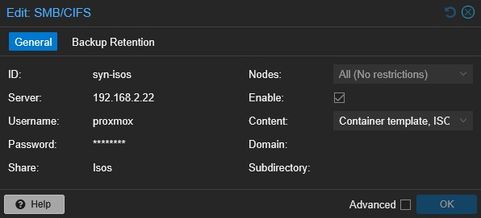
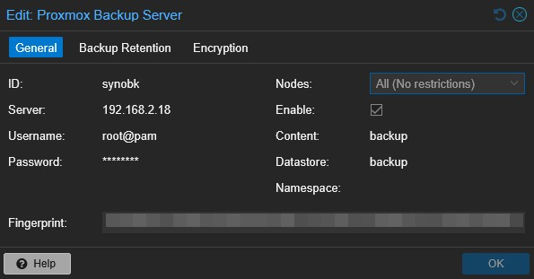

## Nodes
- node.home - <a href="https://node.home:8006" target="_blank">https://node.home:8006</a>
- pve1.home - <a href="https://pve1.home:8006" target="_blank">https://pve1.home:8006</a>
- pve2.home - <a href="https://pve2.home:8006" target="_blank">https://pve2.home:8006</a>
- pve3.home - <a href="https://pve3.home:8006" target="_blank">https://pve3.home:8006</a>

## Storage Mount for Isos


## Proxmox Backup Server


## Repository of LXC/VM Templates
<a href="https://community-scripts.github.io/ProxmoxVE/scripts" target="_blank">https://community-scripts.github.io/ProxmoxVE/scripts</a>

## Fetch LXC Templates

```bash
pveam update
```

```bash
pveam available
```
