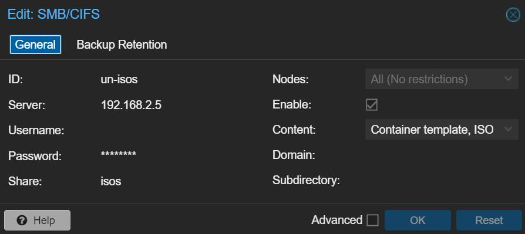

## Nodes
- pve1.home - [https://192.168.2.15:8006](https://192.168.2.15:8006)
- pve2.home - [https://192.168.2.16:8006](https://192.168.2.15:8006)
- node.home - [https://192.168.2.17:8006](https://192.168.2.17:8006)

## Storage Mount for Isos


## Repository of LXC/VM Templates
[https://tteck.github.io/Proxmox/](https://tteck.github.io/Proxmox/)

## Fetch LXC Templates
```bash
pveam update
```
```bash
pveam available
```